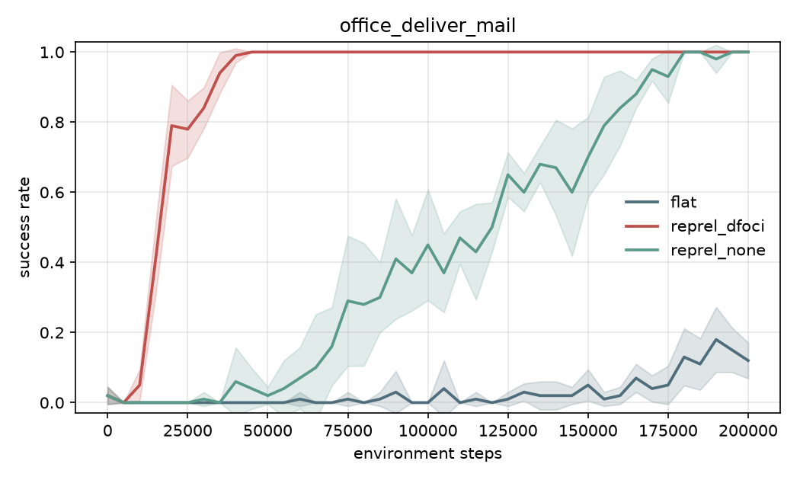
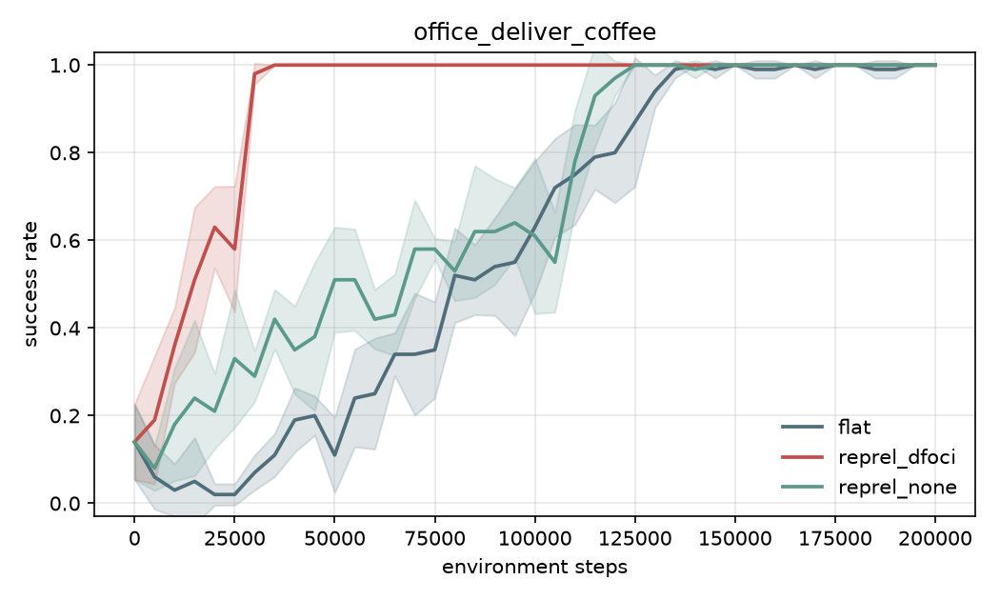
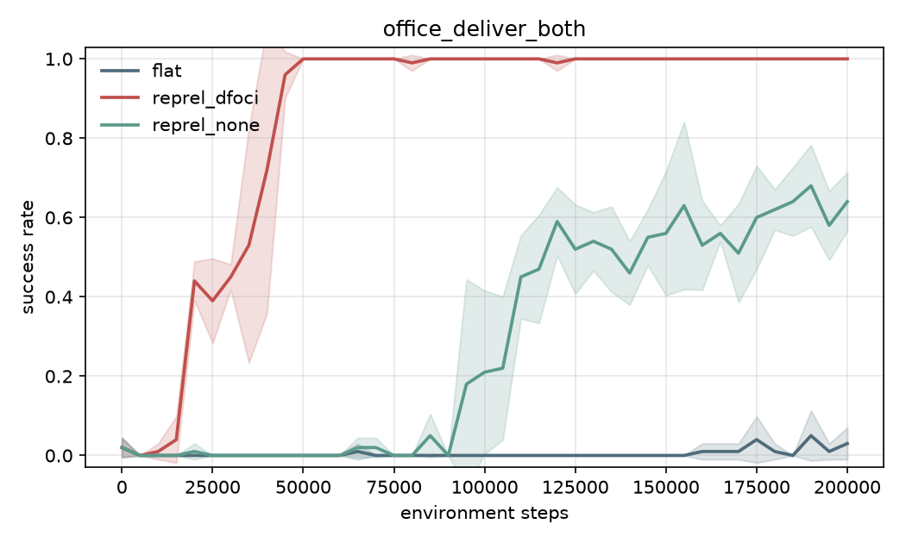
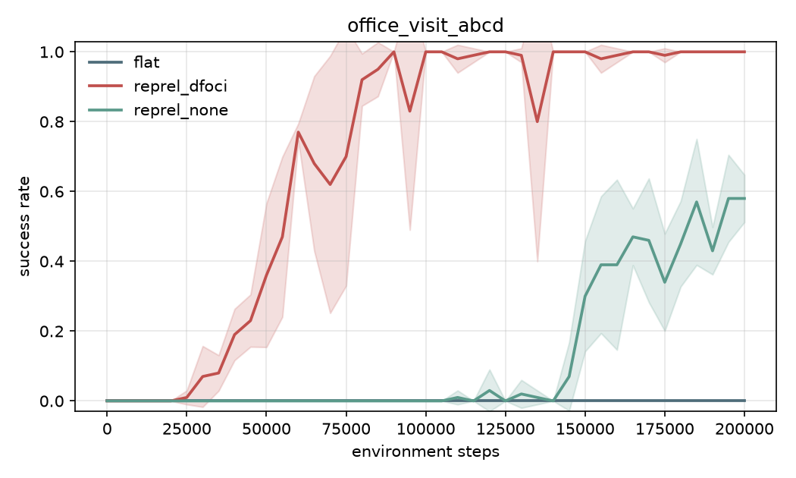
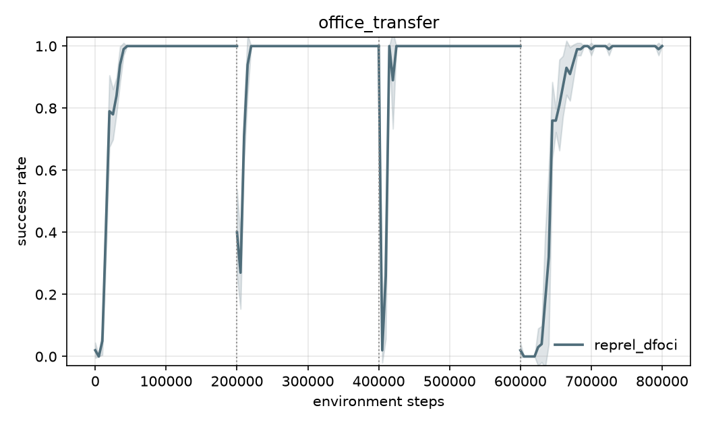
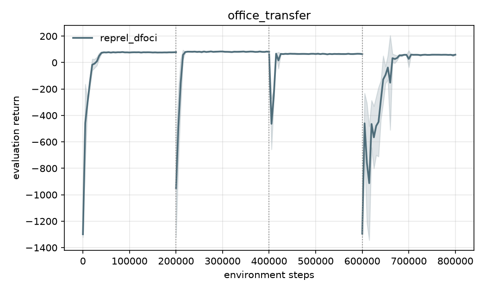

# Office World experiments (milestone 6)

Office World (Illanes et al. 2020, as shipped in RePReL-domains): 12 x 9 grid with thin walls,
locations a/b/c/d, mail room, two coffee cells, the office, six plants. Facts become true by
entering a cell (visited a, holding mail/coffee); entering the office delivers what is held.
Rewards: -1 per step, -10 extra for an invalid move and for standing on a plant, +100 when the
task's goal literals hold. Episode limit 300 steps; the agent starts on a random empty cell.

Same learner and protocol as Taxi: tabular Q-learning, alpha 0.1, gamma 0.99, epsilon linear
0.75 -> 0.01 over 500 episodes, tR = 100 (the task's terminal reward), evaluation every 5k
environment steps with 20 greedy episodes, 5 seeds, mean +/- std. Budget 200k steps per task
(the paper used 30k; its full-state baselines had not converged by then either).

Operators (paper, Table 1): `pickup(X)` for visiting a location or collecting mail/coffee
(terminates on `with(X)`), `deliver(X)` (terminates on `delivered(X)`). D-FOCI statements in
`reprel/dfoci/office.yaml`.

| task | reprel_dfoci: steps to 90% | reprel_none | flat | final return (dfoci / none / flat) |
|---|---|---|---|---|
| 1. deliver mail | 30k | 160k | not reached (12%) | 78.6 / 78.6 / -262.7 |
| 2. deliver coffee | 30k | 115k | 125k | 79.0 / 82.0 / 86.5 |
| 3. deliver mail and coffee | 40k | not reached (64%; 1 seed) | not reached (3%) | 60.9 / -69.4 / -312.6 |
| 4. visit a, b, c, d | 70k | not reached (58%) | not reached (0%) | 41.6 / -129.7 / -385.3 |

 
 

Observations:

- **D-FOCI RePReL converges on every task in 30-70k steps**; the full-state learners only solve
  the two single-delivery tasks within 200k, and `flat` solves only deliver-coffee (a coffee
  cell is never far away). This is the paper's Figure 4 ordering (RePReL >> trl, hrl).
- **Here `reprel_none` is clearly better than `flat`** (unlike Taxi): Office's environment
  reward is sparse (+100 only at the goal), so the planner's per-subtask terminal bonus is
  genuine shaping, and the task's facts partition the state space into phases.
- **On deliver-coffee flat ends with a higher return (86.5) than D-FOCI (79.0).** With two coffee
  cells, the `pickup(coffee)` subtask stops at whichever coffee is reached first, i.e. the
  nearest, while the flat learner can choose the coffee that makes the whole route to the office
  shortest. This is the usual recursive-vs-hierarchical optimality gap of subtask decomposition,
  not a learning failure: all three conditions reach 100% success.

## Transfer through the tasks (`office_transfer`, D-FOCI, 200k steps per stage)

The same two operator tables are trained through the paper's task order without reset:
deliver mail -> deliver coffee -> deliver mail and coffee -> visit a, b, c, d.

 

| stage | zero-shot success at stage start | steps to 90% in stage (transfer) | steps to 90% fresh (table above) | final return (transfer / fresh) |
|---|---|---|---|---|
| deliver mail | 0.02 (untrained) | 30k | 30k | 78.6 / 78.6 |
| deliver coffee | 0.40 +/- 0.15 | 15k | 30k | 81.3 / 79.0 |
| deliver both | 1.00 | 0 | 40k | 64.5 / 60.9 |
| visit a, b, c, d | 0.02 | 55k | 70k | 59.5 / 41.6 |

The transferred agents solve "deliver mail and coffee" zero-shot: both of its subtasks were
learned in the earlier stages, and the lifted `pickup(?X)` / `deliver(?X)` keys carry over.
Deliver-coffee starts at 40% because `deliver(?X)` already works and `pickup(?X)` only has to
learn the coffee cells. Visiting a/b/c/d shares nothing but the movement knowledge in the
`pickup` table, which still saves about a fifth of the steps.

## Comparison with the paper (Figure 4)

| paper | here |
|---|---|
| RePReL reaches the optimum on task 1 in < 10k steps and on the others in < 15k (30k budget) | 30k, 30k, 40k, 70k steps to 90% success (different reward scale and learner; the 300-step episode limit makes early episodes long) |
| trl and hrl do not reach the optimum within 30k on any task | `reprel_none` needs 115-160k on the single-delivery tasks and does not solve tasks 3-4 in 200k; `flat` solves only deliver-coffee |
| RePReL w/ T converges faster on tasks 2-3 (task 2 curves overlap; task 3 gain is large); task 4 is independent so the gain is small | task 2: 15k vs 30k; task 3: zero-shot 100%; task 4: 55k vs 70k |

All of the paper's claims hold qualitatively. One effect the paper does not report: on
deliver-coffee the flat learner's final return is higher than RePReL's, because subtask
decomposition commits to the nearest coffee (see observations above).
