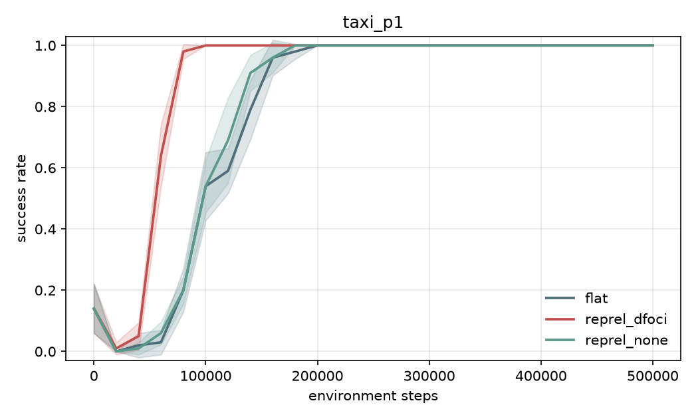
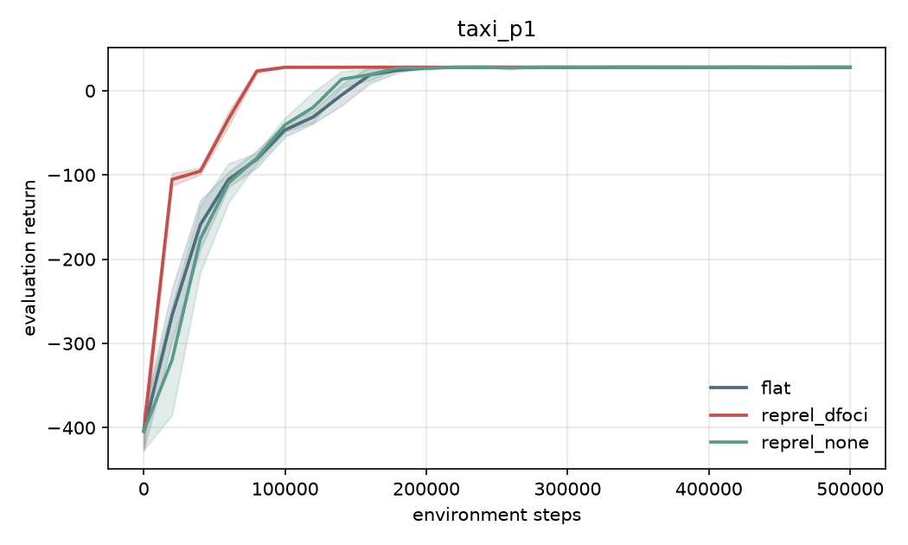
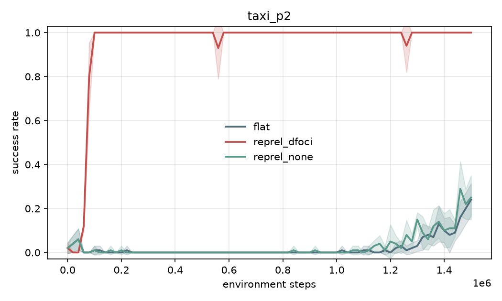
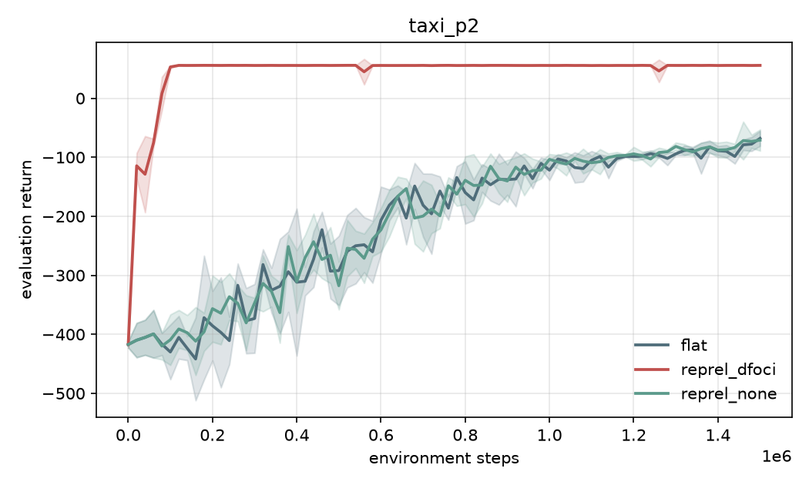
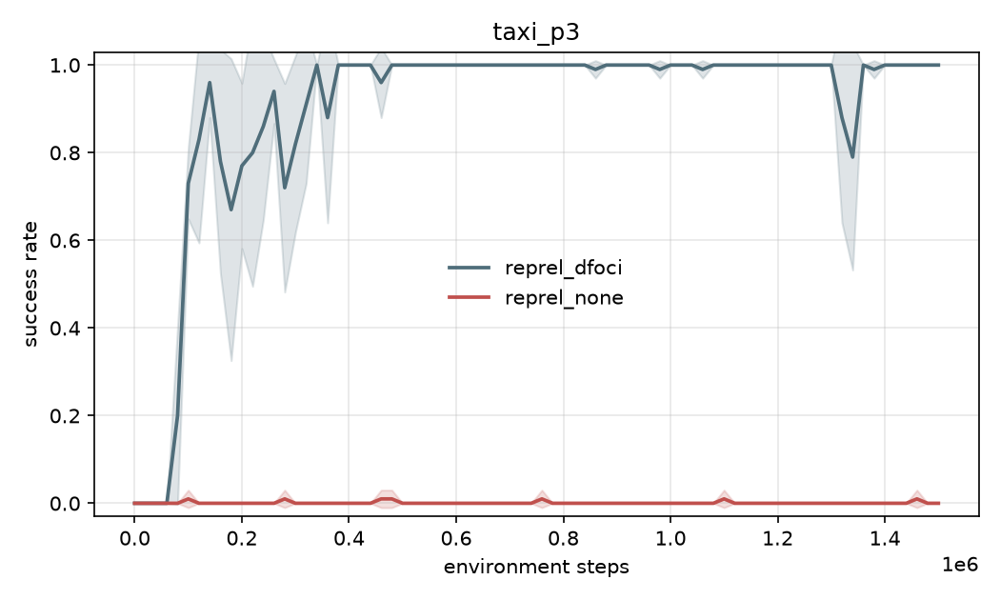
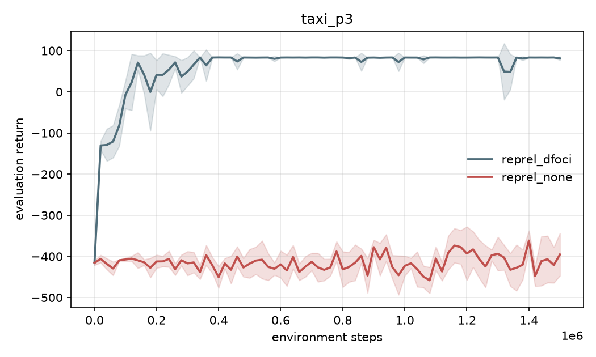
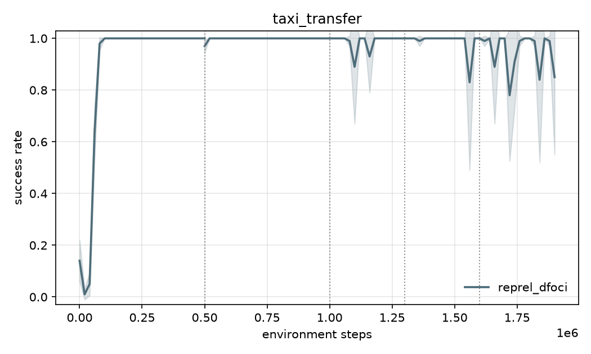
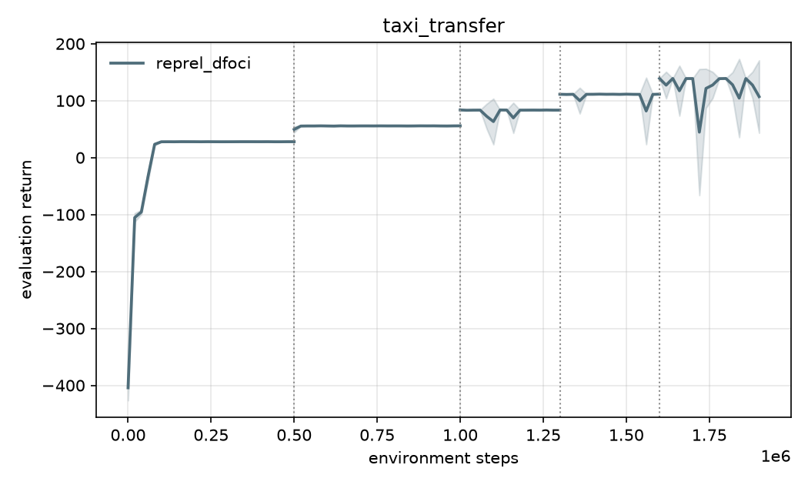
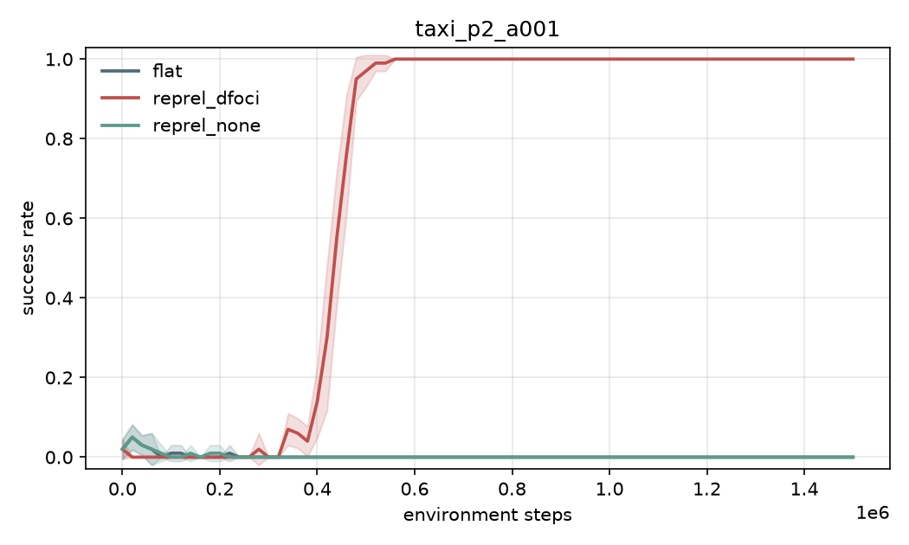
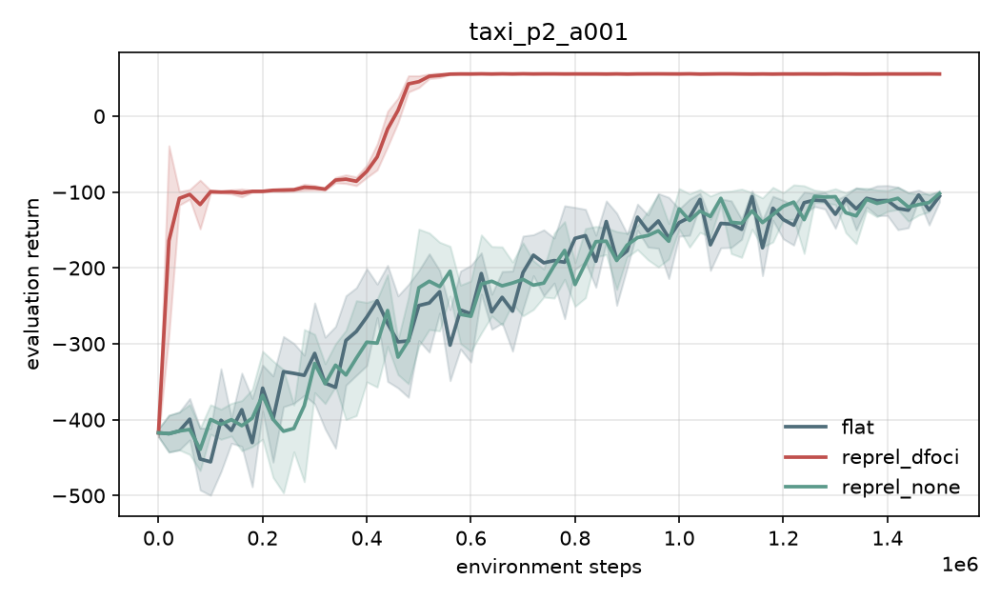

# Taxi experiments (milestone 5)

Relational multi-passenger Taxi, `eight` layout (8x8, depots R/G/B/Y), passengers' pickup and
destination depots sampled per episode, episode limit 1000 steps. Rewards: step -0.1, pickup
+10, drop +20, illegal pickup/drop -1. Subtask terminal bonus tR = 10. Tabular Q-learning with
gamma 0.99, epsilon linear 0.75 -> 0.01 over 2000 episodes, learning rate alpha = 0.1 (main
setting; see section 5 for the paper's 0.01). Evaluation: every 20k environment steps, 20
greedy episodes (epsilon 0.01) on a separate RNG. 5 seeds per condition; curves show mean
+/- std over seeds. Everything here was produced by `outputs/run_all.sh` (see `metrics/` for the
per-seed CSVs, including the run config, git hash and seed of every run in `outputs/`).

Conditions:

| condition | executor | state key | reward to learner |
|---|---|---|---|
| `flat` | one Q-table on the whole task | full ground state | environment reward |
| `reprel_none` | HTN planner + one Q-table per operator | full ground state | environment reward + tR when the operator's termination condition holds |
| `reprel_dfoci` | HTN planner + one Q-table per operator | D-FOCI projection, lifted to operator roles | same |

## 1. One passenger (`taxi_p1`, 500k steps)

 

| condition | steps to 90% success (median) | final success | final return |
|---|---|---|---|
| flat | 160k | 1.00 | 27.9 +/- 0.1 |
| reprel_none | 140k | 1.00 | 27.8 +/- 0.1 |
| reprel_dfoci | 80k | 1.00 | 27.9 +/- 0.1 |

All three converge to the same policy quality; D-FOCI gets there about twice as fast. With a
single passenger the planner's decomposition does not shrink the state: the full state already
determines the phase, so `reprel_none` and `flat` learn over equally large tables and differ
only by the terminal bonus. The expected ordering holds (dfoci > none >= flat) but the gap
between none and flat is small.

## 2. Two passengers (`taxi_p2`, 1.5M steps)

 

| condition | steps to 90% success (median) | final success | final return |
|---|---|---|---|
| flat | not reached | 0.24 +/- 0.07 | -67.9 +/- 12.8 |
| reprel_none | not reached | 0.25 +/- 0.10 | -71.0 +/- 17.9 |
| reprel_dfoci | 80k | 1.00 | 55.7 +/- 0.1 |

The number of ground states grows about 20x; neither full-state learner solves the task in
1.5M steps, while D-FOCI needs the same ~80k steps as for one passenger because its keys do not
mention the other passenger at all. `reprel_none` tracks `flat` throughout: the planner's
subtask rewards do not compensate for a table that is just as large and does not share
anything between passengers.

## 3. Three passengers (`taxi_p3`, 1.5M steps; no `flat`: ~0.5M ground states)

 

| condition | steps to 90% success (median) | final success | final return |
|---|---|---|---|
| reprel_none | not reached | 0.00 | -395 +/- 52 |
| reprel_dfoci | 120k | 1.00 | 81.3 +/- 4.1 |

## 4. Transfer (`taxi_transfer`): train on 1 -> 2 passengers, then 3 -> 4 -> 5 without resetting the tables

 

Zero-shot = the evaluation at the very first point of each stage, before any training on it.

| stage | zero-shot success | zero-shot return | final success (last eval) | final return |
|---|---|---|---|---|
| 1 passenger (500k) | 0.14 (untrained) | -404 | 1.00 | 27.9 |
| 2 passengers (500k) | 0.97 +/- 0.03 | 49.5 | 1.00 | 55.8 |
| 3 passengers (300k) | 1.00 | 83.7 | 1.00 | 83.4 |
| 4 passengers (300k) | 1.00 | 111.2 | 1.00 | 111.4 |
| 5 passengers (300k) | 1.00 | 139.0 | 0.85 +/- 0.30 (see below) | 107.0 |

Fresh 3-passenger training (section 3) needs ~100k steps to reach 73% success; the transferred
agents are at 100% from the first evaluation. This is the paper's "RePReL+T performs tasks 2
and 3 seamlessly" result.

**Transient dips.** After convergence the D-FOCI curves occasionally drop for a single
evaluation point (to 0.2-0.7 success) and recover by the next one: never on 1 passenger, once in
2 of 5 seeds on 2 passengers, 1-3 times per seed over the 3-5 passenger stages. The 0.85 final
value on 5 passengers is one seed's dip landing on the last evaluation. The mechanism is the
flip side of lifting: all passengers share one table, so a single temporarily wrong greedy action
in a shared key (alpha 0.1, exploration still on) spoils every subtask that visits it until it is
corrected, and an episode with 10 subtasks is exposed to it far more than one with 2.

## 5. The paper's learning rate (`taxi_p2_a001`: alpha = 0.01, 2 passengers, 1.5M steps)

 

| condition | steps to 90% success (median) | final success | final return |
|---|---|---|---|
| flat | not reached | 0.00 | -105.5 +/- 7.3 |
| reprel_none | not reached | 0.00 | -101.9 +/- 1.2 |
| reprel_dfoci | 480k | 1.00 | 55.6 +/- 0.2 |

Same ordering, everything six times slower: at alpha 0.01 D-FOCI RePReL needs ~480k steps
instead of ~80k, and the two full-state learners make no progress at all within 1.5M steps.
The released tabular code uses 0.01 (for Box World, with a 1.5M-step budget); the Taxi
tabular code was never released, so alpha = 0.1 is our choice for the main runs, made before
the 5-seed experiments on the basis of a single-seed pilot and reported here rather than tuned.

## 6. Comparison with the paper (Kokel et al. 2021, Figure 5; StarAI 2021, Figure 1c-d)

The paper plots episode reward against 0-100k environment steps for RePReL, Taskable RL (trl)
and option-based HRL on tasks with 1, 2 and 3 passengers. What it shows and what we see:

| paper | here |
|---|---|
| RePReL reaches the optimal reward within roughly 20-30k steps on all three tasks | D-FOCI RePReL reaches 90% success at a median of 80k (1-2 passengers) and 120k (3 passengers) steps at alpha 0.1; 480k at the paper's 0.01 |
| trl (planner, no abstraction) stays at the failure level for the whole 100k budget on every task | `reprel_none` learns the 1-passenger task by 140k steps and never learns 2 or 3 passengers within 1.5M |
| RePReL w/ T starts at the optimum on tasks 2 and 3 ("seamlessly without any additional learning") | zero-shot success 0.97 on 2, 1.00 on 3, 4 and 5 passengers after training on fewer |
| no flat Q-learning baseline | `flat` tracks `reprel_none` throughout (1 passenger: 160k vs 140k steps; 2 passengers: both ~25% at 1.5M) |

Qualitatively the reproduction matches on every claim the paper makes: abstraction gives a large
sample-efficiency gain that grows with the number of objects, and the lifted policies transfer
zero-shot to more passengers. Absolute step counts are not comparable: the paper's tabular Taxi
hyperparameters, map and reward scale are unreleased (its episode rewards are in the thousands,
ours in the tens), and its curves stop at 100k steps.

Two things the paper does not show, found here:

1. **No-abstraction RePReL is not better than flat Q-learning on Taxi.** The brief expected
   dfoci > none > flat; we get dfoci >> none ~= flat. With full-state keys the planner only
   partitions the table across operators and adds a terminal bonus on top of already dense
   environment rewards, so it buys nothing measurable.
2. **Transient dips after convergence** in the lifted tables (section 4), growing with the
   number of subtasks per episode.

## Faithfulness notes

- Subtasks run until their termination condition holds or the episode ends (Algorithm 1):
  there is no operator step budget, no failure condition, and no replanning in these runs,
  exactly as in the paper. (The executor supports a step budget with replanning; it is off.)
- Only the active operator's table is updated per step; the terminal bonus tR is added on
  termination; epsilon-greedy exploration is correct here, whereas it never fires in the
  released code (see `plan/2026-10-06-m0-original-reprel-summary.md`, section 5).
- The D-FOCI statements are the paper's Table 1 (`reprel/dfoci/taxi.yaml`), with walls as
  explicit static atoms.
